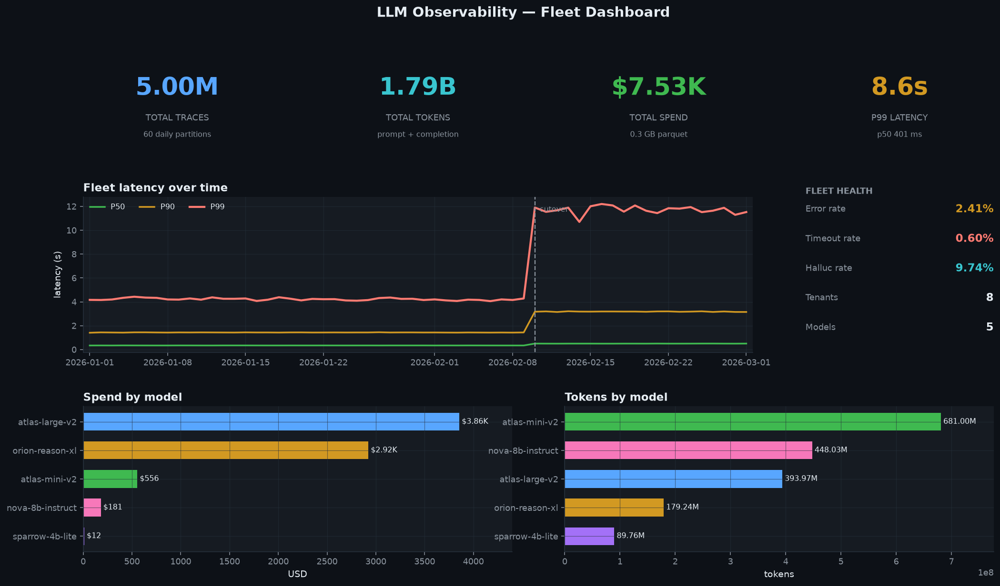
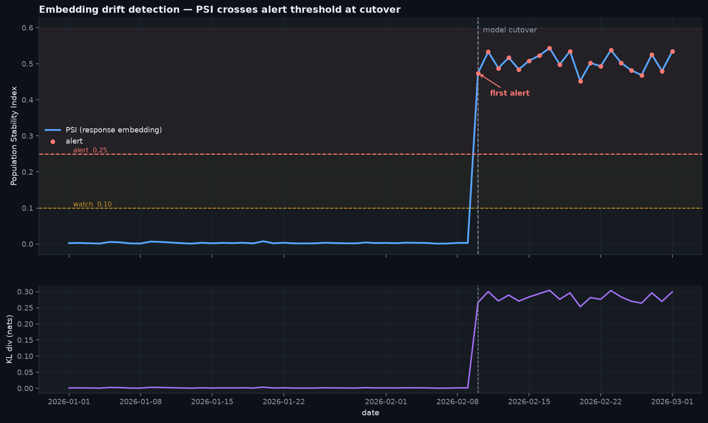
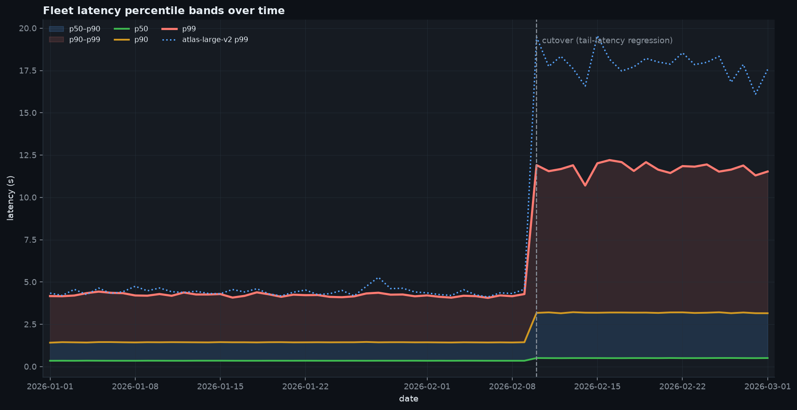
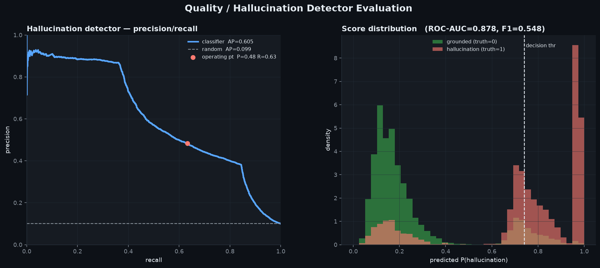

# LLM Observability & Evaluation Platform

Trace analytics + quality monitoring for LLM fleets at scale — a self-contained,
**fully offline** reference implementation. It generates a realistic multi-tenant
LLM trace firehose, lands it as partitioned Parquet, and runs four production
concerns over it: **cost/latency analytics (DuckDB, out-of-core)**,
**embedding-drift detection (PSI/KL)**, a **hallucination detector
(heuristic + logistic)**, and a **per-model eval scorecard** — with generated,
product-grade dashboards.

> **Real scale achieved:** **5,000,000 traces** over 60 days across 5 models and
> 8 tenants → **1.79 billion tokens**, **$7,529 tracked spend**, **0.34 GB**
> zstd Parquet (60 daily partitions), generated in **233 s**. Full analytics
> layer answers fleet-wide KPI, cost-by-model, and latency-percentile queries in
> **0.6–2.0 s each, out-of-core** on a single 4-core box. Architected for
> **1B+ rows/month** — see [ARCHITECTURE.md](ARCHITECTURE.md).

## Project Document

- Prepared for **Sai Veda**
- Publishing account: **Nikeshk834**
- Full handoff note: [`PROJECT_DOCUMENT.md`](./PROJECT_DOCUMENT.md)

## Screenshots

### Fleet dashboard — KPI tiles, latency-over-time, spend/tokens by model


### Drift detection — PSI crosses the alert threshold exactly at the model cutover


### Latency percentile bands — the injected tail-latency regression is unmistakable


### Hallucination detector — PR curve + score distribution vs a random baseline


## Quickstart

```bash
pip install -r requirements.txt        # numpy pandas pyarrow duckdb scikit-learn scipy matplotlib polars pytest

make all          # generate 5M traces -> run pipeline -> render screenshots
# or step by step:
make data TRACES=5000000   # synthetic traces -> data/traces/date=*/data.parquet
make run                   # DuckDB analytics + drift + detector + eval -> benchmarks/
make screenshots           # 4 PNGs -> assets/
make test                  # pytest suite
make bench                 # scaling benchmark -> benchmarks/scaling.{csv,md}
```

Everything is deterministic (seeded) and needs **no API keys, no GPU, no network**.

## What it does

| Stage | Module | What it produces |
|---|---|---|
| **Generate** | `src/llmobs/generate.py` | Streamed synthetic traces → Hive-partitioned Parquet. Request/response text, model, prompt/completion tokens, latency, cost, tool calls, tenant/user, timestamps + injected errors, timeouts, hallucinations, and a post-cutover **drift regime**. |
| **Analytics** | `src/llmobs/analytics.py` | Out-of-core DuckDB SQL: KPI overview, cost/tokens/latency-percentiles by model, daily time-series, tenant chargeback, throughput (rpm). |
| **Drift** | `src/llmobs/drift.py` | Deterministic TF-IDF (hashing) + SVD embeddings → **PSI** and **KL divergence** per day vs a baseline window; raises alerts at PSI ≥ 0.25. |
| **Detector** | `src/llmobs/detector.py` | Groundedness heuristic + logistic classifier over text/token features; precision/recall/F1/AUC/AP vs a random baseline. |
| **Eval** | `src/llmobs/evalharness.py` | Per-model quality scorecard (composite groundedness + reliability + latency-SLO score) with letter grades + fleet rollup. |

## Headline numbers (from the 5M-trace run)

| Metric | Value |
|---|---|
| Traces / tokens / spend | 5,000,000 / 1.79B / $7,529.47 |
| Parquet footprint | 0.34 GB (zstd, 60 daily partitions) |
| Generation throughput | 5M traces in 233 s end-to-end (incl. compression) |
| p50 / p99 latency (fleet) | 401 ms / 8,605 ms |
| Error / timeout rate | 2.41% / 0.60% |
| Ground-truth hallucination rate | 9.74% |
| **Drift** — first alert | day 40 = 2026-02-10, **exactly the injected cutover** (20 alert days, PSI 0.005 → ~0.53) |
| **Detector** — ROC-AUC / AP | **0.878 / 0.605** vs random AP 0.099 (**6.1× lift**) |
| **Detector** — precision / recall / F1 | 0.48 / 0.63 / 0.55 at the F1-optimal threshold |
| Fleet weighted quality | 0.893 (best `atlas-mini-v2` A, worst `atlas-large-v2` C) |

### Per-model scorecard (eval harness)

| model | traces | cost $ | p50 ms | p99 ms | halluc % | quality | grade |
|---|---|---|---|---|---|---|---|
| atlas-mini-v2 | 1.90M | 556 | 320 | 1,783 | 8.6% | 0.951 | A |
| sparrow-4b-lite | 0.25M | 12 | 160 | 898 | 8.6% | 0.951 | A |
| nova-8b-instruct | 1.25M | 181 | 239 | 1,321 | 8.6% | 0.951 | A |
| orion-reason-xl | 0.50M | 2,924 | 1,593 | 8,885 | 8.7% | 0.795 | C |
| atlas-large-v2 | 1.10M | 3,857 | 1,206 | 13,567 | **13.8%** | 0.757 | C |

`atlas-large-v2` is the deliberately-regressed model: after the cutover its tail
latency inflates (p99 ~5.7 s → ~17.5 s) and its hallucination rate jumps to
~26%, dragging its scorecard to a **C** — exactly what the drift and detector
stages independently flag.

### Query performance (out-of-core DuckDB over 5M rows)

| Query | Latency |
|---|---|
| Fleet KPI overview | 2.0 s |
| Cost / latency percentiles by model | 1.6 s |
| Daily time-series (60 days) | 1.9 s |
| Cost by tenant | 0.8 s |
| Throughput (per-minute) | 0.6 s |

_All queries scan Parquet directly; nothing materialises the full table in RAM._

## Scaling benchmark

Generation throughput and query latency scale roughly linearly with rows while
memory stays flat (one day of traffic at a time). Full table in
[`benchmarks/scaling.md`](benchmarks/scaling.md).

<!-- SCALING_TABLE -->

See [ARCHITECTURE.md](ARCHITECTURE.md) for the path from this single-box run to
**1B+ traces/month** (horizontal generation, lakehouse SQL over the same
Parquet, sampled drift/detector cost that is independent of corpus size).

## Testing

`make test` runs 21 assertions that check real behaviour, not smoke:

- **PSI spikes at the boundary** — pre-cutover PSI stays below alert, post-cutover
  breaches it, and the first alert lands at/after the injected cutover day.
- **Percentile math is correct** — DuckDB `quantile_cont` matches NumPy to 1e-4,
  and p50 ≤ p90 ≤ p99 holds per model.
- **Cost aggregation is exact** — recomputed from tokens × pricing, and
  overview total == Σ by-model == Σ by-day == Σ by-tenant.
- **The detector beats random** — ROC-AUC > 0.75, AP > 3× the prevalence
  baseline, and a usable operating point (P, R, F1 all well above chance).
- Plus generator determinism, schema/no-null checks, unique trace IDs, and the
  injected regime shift (hallucination + error rates rise after cutover).

## Layout

```
04-llm-observability-eval/
├── src/llmobs/        config, generate, analytics, drift, detector, evalharness, viztheme
├── scripts/           generate_data.py, run_pipeline.py, make_screenshots.py, benchmark_scaling.py
├── tests/             test_generate / test_analytics / test_drift / test_detector
├── benchmarks/        scale.json, *.csv, scaling.md  (regenerated by make run/bench)
├── assets/            dashboard / drift_timeline / latency_bands / detector .png
├── ARCHITECTURE.md    design decisions + scaling-to-1B story
├── Makefile · requirements.txt · .gitignore
```

## Design notes
- **Deterministic everywhere** — one `GLOBAL_SEED` threads through generation,
  sampling, SVD, and the classifier; day-shards are independently seeded so any
  day is reproducible in isolation.
- **Honest scale** — the 5M run is real and measured; the 1B story is the same
  code with horizontal partitioning, documented, not claimed as executed.
- **No real vendors or data** — all model names, tenants, pricing, and text are
  synthetic.
